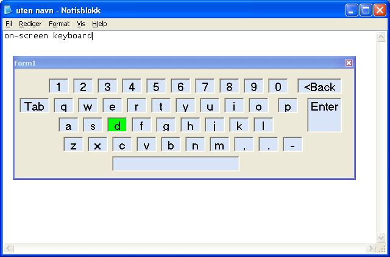



## On\-screen keyboard

### Description

On-screen / touchscreen keyboard. Stays on top, but dosent take the focus.

Hooks the mouse; Code by:

http://www.planetsourcecode.com/vb/scripts/ShowCode.asp?txtCodeId=55676&amp;lngWId=1
 
### More Info
 

             |
---                |---
**Submitted On**   |2007-12-09 19:53:34
**By**             |[Thomas Sorensen](https://github.com/Planet-Source-Code/PSCIndex/blob/master/ByAuthor/thomas-sorensen.md)
**Level**          |Intermediate
**User Rating**    |4.9 (44 globes from 9 users)
**Compatibility**  |VB 6\.0
**Category**       |[Coding Standards](https://github.com/Planet-Source-Code/PSCIndex/blob/master/ByCategory/coding-standards__1-43.md)
**World**          |[Visual Basic](https://github.com/Planet-Source-Code/PSCIndex/blob/master/ByWorld/visual-basic.md)
**Archive File**   |[On\-screen\_2093211292007\.zip](https://github.com/Planet-Source-Code/thomas-sorensen-on-screen-keyboard__1-69746/archive/master.zip)

